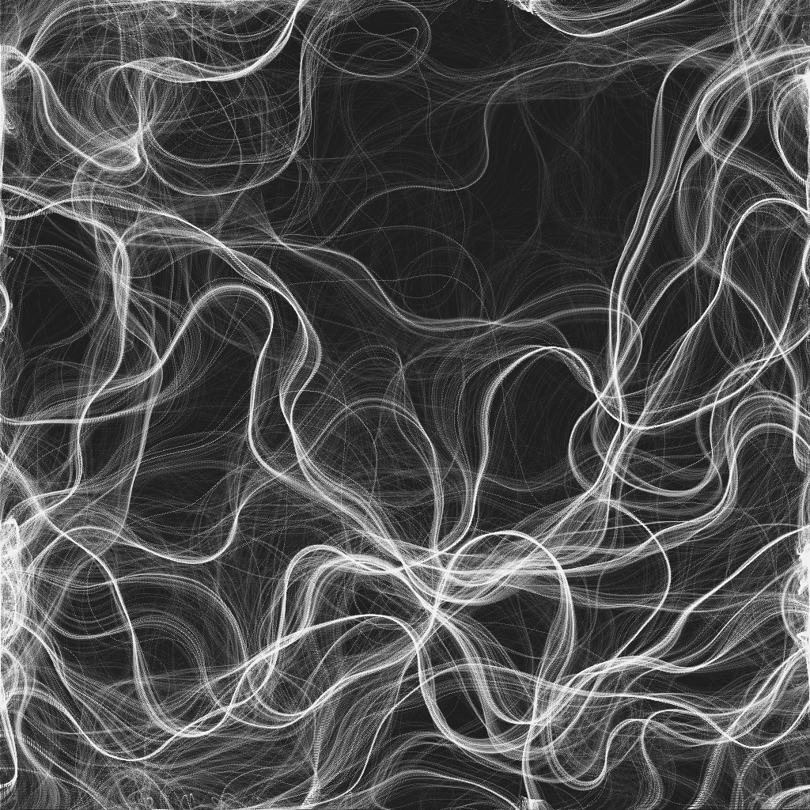

This demo generates smoke trails live. By 'live', I mean you'll be able to see to particles snaking their way around the canvas; leaving their visible paths behind as they go. It's pretty nice to watch.

If you allow the demo to run for under a minute, you should hopefully see something like this:

