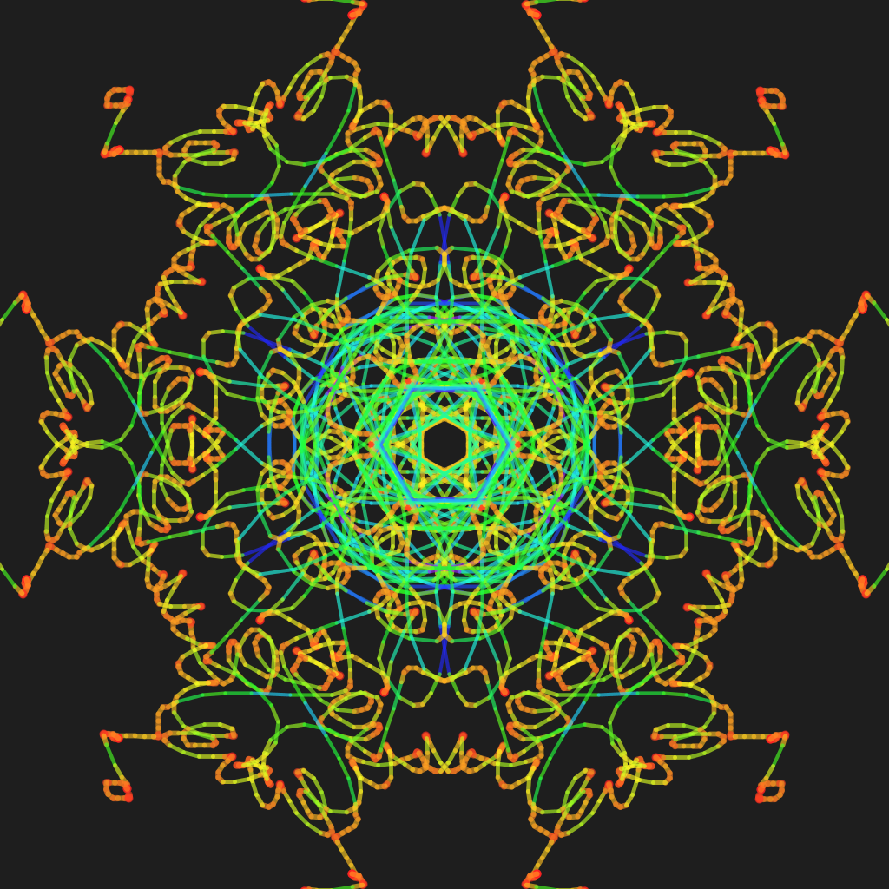

This is a simple kaleidoscope. As you hold down the mouse-button, symmetrical patterns will appear. The color depends upon the velocity of the cursor.

As an example, I made this in a couple of seconds:

